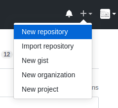
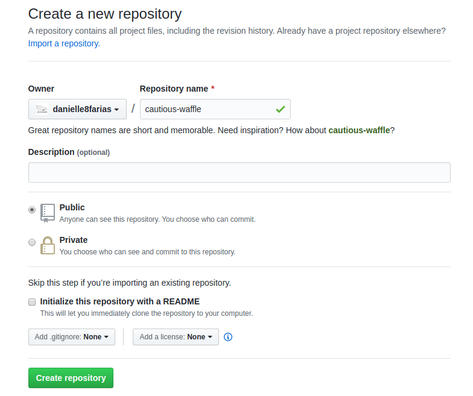
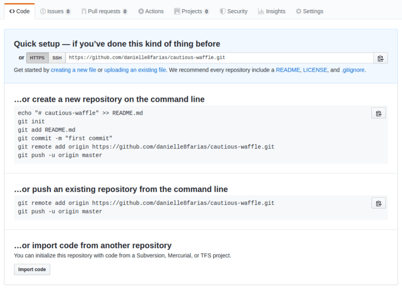
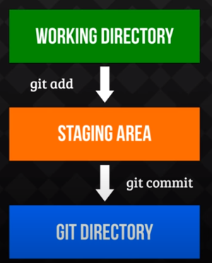

### Baixando o Git

-   Se você usa o Linux, você pode seguir o nosso tutorial: [Instalando, configurando e inicializando o Git no Linux](https://dev.to/womakerscode/instalando-configurando-e-inicializando-o-git-no-linux-2m96)
-   Se você usa o Windows, você pode seguir o nosso tutorial: [Instalando, configurando e inicializando o Git no Windows](https://dev.to/womakerscode/tutorial-instalando-configurando-e-inicializando-o-git-no-windows-57cj)
---

### Criando uma conta no Github

-   Basta acessar a página do [Github](https://github.com/) e escolher seu nome de usuária, informar seu email e criar uma senha.
---

### Criando um repositório no GitHub

-   Acesse sua conta no [Github](https://github.com/) e clique no sinal de mais para abrir o menu e em seguida em New repository.




Dê o nome de sua preferência, além da descrição e indique se seu repositório será público ou privado.



Para finalizar, clique em Create repository.

Em seguida aparecerá uma tela com três opções:



- A primeira diz respeito a crianção de um novo repositório (inclui a inicialização do Git no diretório).

- A segunda diz respeito a um repositório já existente e que desejo colocar no GitHub (é a situação que irei utilizar).

- A terceira diz respeito a importação de um código de outro repositório.

---

### Criando repositório local
Na pasta/diretório que você deseja versionar, digite:

```
git init
```
---

### Ver estado do Git
```
git status
```
Use esse comando sem moderação.
---

### Adicionando seus arquivos ao Git
```
git add nome_do_arquivo
```
ou para adicionar todos os arquivos de uma só vez:

```
git add *
```
Agora é preciso fazer o commit para que o Git possa rastrear suas modificações:
```
git commit -m 'seu comentário sobre seus arquivos aqui'
```

---

### Atualizando commit de arquivo modificado
```
git commit -am 'digite sua mensagem aqui'
```
---

### Ligando seu repositório local a sua nuvem
```
git remote add origin link_para_o_repositório_do_seu_projeto
```
No meu caso:
```
git remote add origin https://github.com/danielle8farias/cautious-waffle.git
```
---
### Enviando suas alterações
Pela primeira vez:
```
git push -u origin master
```
Nas próximas vezes basta
```
git push
```
---

### Copiando um repositório
```
git clone link_para_o_repositório_que_deseja_copiar
```
Exemplo:
```
git clone https://github.com/danielle8farias/cautious-waffle.git
```
---

### Criando branches
```
git checkout -b nome_do_branch
```

Para voltar ao branch master:
```
git checkout master
```

O comando:
```
git checkout nome_do_branch
```

faz a troca entre os branches.
Seus branches locais não estarão na nuvem a menos que você os envie.
```
git push origin nome_do_branch
```
---

### Unindo branches
```
git merge nome_do_branch
```
---

### Atualizando seu repositório local
Pega as modificações que foram feitas no repositório remoto.
```
git pull
```
---

### Desfazendo commits
```
git revert chave_do_commit
```
A chave do commit é encontrada através do comando:
```
git log
```
---
### Entendendo o fluxo do Git

- working directory: sua pasta/diretório.
- index (staging area): a sala de espera do Git. Para onde vão os commits antes do push.
- master: branch principal. O branch padrão do Git.
- HEAD: por padrão, aponta para o último commit recebido dentro do repositório.